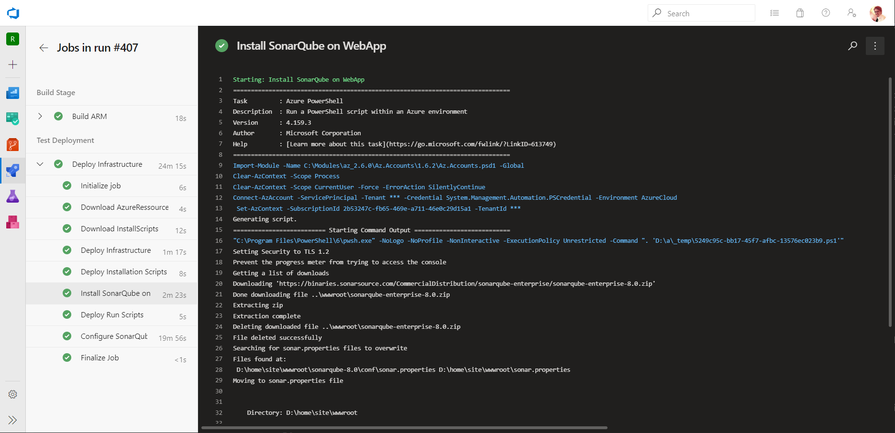

[[_TOC_]]

---

# Sonar Qube as a Service

This repository should give you the possibility to automatically deploy SonarQube with Azure SQL on a WebApp deploy via Azure DevOps Pipelines.

## Use Case

When you are in an enterprise environment or you have very strict rules when it comes to intellectual property, then you might not want to use cloud services without a proper NDA (non disclosure agreement) or you do want to limit the number of service provider that you use for different services. In case of SonarQube the SaaS equivalent is SonarCloud. SonarCloud is hosted by SonarSource in their own cloud environment in AWS. But you have no control over it.

Maybe you want to still use this tool in the cloud. This solution gives you the possibility to leverage PaaS services in Azure only and setup the whole solution automatically. The solution gives you the possibility for somebody who wants to implement something like "Static Code Analysis as a Service".

In this case you solve several problems:

* disaster recovery
* fast deployment
* multiple deployments
* all automatically
* best practices for infrastructure, security and governance

The idea is to provide a solution ready to use even in your company or for private use. You might even only want to evaluate SonarQube for yourself without setting it up with a lot of effort.

## Get Started

These are the steps need to deploy the solution. If you know how to do it, then go forward. Otherwise I linked the explanation to the sections further below.


1. [Register Azure AAD App](https://learn.microsoft.com/en-us/graph/auth-register-app-v2)
2. [Create a project on Azure DevOps](https://learn.microsoft.com/en-us/azure/devops/organizations/projects/create-project?view=azure-devops&tabs=browser#create-a-project)
3. [Create a Service Connection in your Project](https://learn.microsoft.com/en-us/azure/devops/pipelines/library/service-endpoints?view=azure-devops&tabs=yaml#create-a-service-connection)
4. [Create Variable group](https://docs.microsoft.com/en-us/azure/devops/pipelines/library/variable-groups?view=azure-devops&tabs=yaml#create-a-variable-group)
5. Integrate Pipeline into Azure DevOps
6. Run Pipeline
7. Add SonarQube license key

## Architecture

The architecture allows PaaS (platform as a service) only to leverage Azure service to the fullest. The following resources are being created:

* web app with app service plan
* Azure sql server with a database
* application insights getting telemetry from the web app

See the image below to get an impression of the overall architecture.


The architecture tries to follow best practices for security.
Also the access to SonarQube is restricted to Azure AD accounts only.

### ARM Template

show arm template parts and explain parameters

### Deploy Infrastructure Only

If you want to deploy only the infrastructure directly over the portal, you can use the deploy buttons.

<a href="https://portal.azure.com/#create/Microsoft.Template/uri/https%3A%2F%2Fraw.githubusercontent.com%2FRazorSPoint%2FSonarQubeAsAService%2Fmaster%2FARM%2Fsonar.azuredeploy.json" target="_blank">
    
</a> <a href="http://armviz.io/#/?load=https%3A%2F%2Fraw.githubusercontent.com%2FRazorSPoint%2FSonarQubeAsAService%2Fmaster%2FARM%2Fsonar.azuredeploy.json" target="_blank">
    
</a>

## Authentication with Azure AAD

You need an application that will be used to authenticate any user against the SonarQube with only AAD accounts. In order to do so, you need to [register an AAD application](https://docs.microsoft.com/en-us/graph/auth-register-app-v2) in your Azure tenant.

The information you need with the pipeline are the following:

* app id
* app secret
* tenant id

You will also need to configure the reply URL for SonarQube. So figure out the web app URL you want to use before you deploy it. You can also [follow the registration process](To create the correct application, please [follow their documentation](https://github.com/hkamel/sonar-auth-aad/wiki/Setup#creating-the-sonarqube-application-in-azure).) described by the SonarQube plugin for AAD authentication.

## Pipeline



### Create a Azure DevOps Project

In order to use this pipeline, you [need an organization](https://docs.microsoft.com/en-us/azure/devops/organizations/accounts/create-organization?view=azure-devops). If you have one, then [create a new project](https://docs.microsoft.com/en-us/azure/devops/organizations/projects/create-project?view=azure-devops&tabs=preview-page#create-a-project).

### Create a Service Connection

Create a service connection being used for the pipeline. Check the microsoft documentation article for [Creating a service connection](https://docs.microsoft.com/en-us/azure/devops/pipelines/library/service-endpoints?view=azure-devops&tabs=yaml#create-a-service-connection)

> **Important:** In order to be able to create a connection to your Azure tenant, you need to have the permission to register applications in your tenant and you must have Owner permissions on your target subscription. If this is blocked in your tenant, you must ask an administrator. [The documentation can give](https://docs.microsoft.com/en-us/azure/devops/pipelines/library/connect-to-azure?view=azure-devops#create-an-azure-resource-manager-service-connection-with-an-existing-service-principal) a more elaborate explanation.

### Create a Variable Group

In order that the project works you need to [create a variable group](https://docs.microsoft.com/en-us/azure/devops/pipelines/library/variable-groups?view=azure-devops&tabs=yaml#create-a-variable-group) in your project.
You find them under the following url pattern, where `{organization}` is your organization and `{project}` is your project name.

```HTTP
https://dev.azure.com/{organization}/{project}/_library?itemType=VariableGroups
```

Create a variable group with the name "SonarQube as a Service" (exactly with this name!) and give it a description.
Then create the following variables.

|Name  |Value  |Is Secret  |
|---------|---------|---------|
|AzureConnectionServiceName     |  name of the connection previously created for the pipeline       |   no      |
|SqlAdmin     | name of the sql admin user        |   no      |
|SqlAdminPassword     | secure password of the sql admin       |  yes       |
|SubscriptionGuid     | subscription id where the resources are deployed to        |  no       |
|SuffixName     |  unique string appended to the resource names       |     no    |
|SonarAdmin     |  ssid (mail) of the AAD user that should be added as the initial admin       |     no    |
|SonarAppId     |  app id created in the AAD for authentication       |     no    |
|SonarAppSecret     |  app secret created in the AAD for authentication       |     no    |
|TenantId     |  tenant ID where the app was registered       |     no    |

### Pipeline Variables

The following variables are defined in the pipeline.

|||
|---------|---------|
|HostingPlan     |  name of the app service plan       |
|SqlDb     |    name of the sql database     |
|SqlServer     |  name of the sql server       |
|Website     |   name of the web app     |
|ResourceGroup     |  name of the resource group to deploy to      |
|SkuCapacity     |  horizontal scale of the web app       |
|SkuSize     |  vertical scale size of the web app       |

## Shoutouts and References

### SonarQube PowerShell cmdlets
Used some of the cmdets for accessing the SonarQube api.

**Repository:** SonarQubePS-Master


### SonarQube on a WebApp basic idea
I used some of the PowerShell scripts like and parts of the ARM template for the web app to get SonarQube running on a PaaS service.

**Repository:** SonarQube-AzureAppService-Master  
# SonarQube-AzureAppService
This project is to facilitate hosting [SonarQube](https://www.sonarqube.org/) in an [Azure App Service](https://azure.microsoft.com/en-us/services/app-service/) directly. This does not require SonarQube to be in a Linux container. You can also use the same [HttpPlatformHandlerStartup.ps1](https://github.com/vanderby/SonarQube-AzureAppService/blob/master/HttpPlatformHandlerStartup.ps1) and [HttpPlatformHandler](https://docs.microsoft.com/en-us/iis/extensions/httpplatformhandler/httpplatformhandler-configuration-reference) extension to host SonarQube in IIS on a hosted machine. This would eliminate the need for more complicated setup of IIS as a reverse proxy.

This project uses the embedded database. It is recommended for production to move to a proper database (MSSQL, Oracle, MySQL, Postgre) which can also be a hosted in Azure.

[](https://portal.azure.com/#create/Microsoft.Template/uri/https%3A%2F%2Fraw.githubusercontent.com%2Fvanderby%2FSonarQube-AzureAppService%2Fmaster%2Fazuredeploy.json)


## Azure Clouds
[Deploy to Azure Public Cloud](https://portal.azure.com/#create/Microsoft.Template/uri/https%3A%2F%2Fraw.githubusercontent.com%2Fvanderby%2FSonarQube-AzureAppService%2Fmaster%2Fazuredeploy.json)  
[Deploy to Azure US Government Cloud](https://portal.azure.us/#create/Microsoft.Template/uri/https%3A%2F%2Fraw.githubusercontent.com%2Fvanderby%2FSonarQube-AzureAppService%2Fmaster%2Fazuredeploy.json)   


## Getting Started
Use the ***Deploy to Azure*** button above to deploy out an Azure App Service along with the additional files from this project. SonarQube may take up to 10 minutes to start the first time. This will deploy out a Basic (B1) App Service and have SQ use an in-memory database.

## Passthrough Application Settings
You can set SonarQube sonar.properties settings based on the Azure application settings. Anything prefixed with sonar.* will at runtime be set in sonar.properties file if it matches a property there. This enables settings to be defined in the ARM template and set at runtime.

> Note: All entries in the sonar.properties file are commented out by the HttpPlatformHandlerStartup **(Code Below)** script on startup. To change the Sonar properties add the application settings entry in the configuration blade (e.g. Name = sonar.jdbc.password; Value = XXXXX).

**HttpPlatformHandlerStartup**
```
param(
    [string]$ApplicationInsightsApiKey = $Env:Deployment_Telemetry_Instrumentation_Key
)

function log($message) {
    [DateTime]$dateTime = [System.DateTime]::Now
    Write-Output "$($dateTime.ToLongTimeString()) $message"
}

function TrackEvent {
    param (
        [string]$InstrumentationKey,
        [string]$EventName
    )

    log($EventName)
    if ($InstrumentationKey) {
        $uniqueId = ''
        if ($Env:WEBSITE_INSTANCE_ID) {
            $uniqueId = $Env:WEBSITE_INSTANCE_ID.substring(5, 15)
        }

        $properties = @{
            "Location"        = $Env:REGION_NAME;
            "SKU"             = $Env:WEBSITE_SKU;
            "Processor Count" = $Env:NUMBER_OF_PROCESSORS;
            "Always On"       = $Env:WEBSITE_SCM_ALWAYS_ON_ENABLED;
            "UID"             = $uniqueId
        }

        $body = ConvertTo-Json -Depth 5 -InputObject @{
            name = "Microsoft.ApplicationInsights.Dev.$InstrumentationKey.Event";
            time = [Datetime]::UtcNow.ToString("yyyy-MM-dd HH:mm:ss");
            iKey = $InstrumentationKey;
            data = @{
                baseType = "EventData";
                baseData = @{
                    ver        = 2;
                    name       = $EventName;
                    properties = $properties;
                }
            };
        }

        Invoke-RestMethod -Method POST -Uri "https://dc.services.visualstudio.com/v2/track" -ContentType "application/json" -Body $body | out-null
    }
}

function Set-Property-Value {
    param (
        [string]$ConfigContent,
        [string]$PropertyName,
        [string]$PropertyValue
    )

    if ($PropertyName -eq "sonar.jdbc.url") {
        $dbDriver = $PropertyValue | Select-String -Pattern '^jdbc:([^:]*):' | % { $_.matches.groups[0] }
        [regex]$pattern = "(?m)^#?$([regex]::Escape($PropertyName))=$([regex]::Escape($dbDriver)).*"
        $ConfigContent = $pattern.replace($ConfigContent, "$propertyName=$propertyValue", 1)
    }
    else {
        [regex]$pattern = "(?m)^#?$([regex]::Escape($PropertyName))=.*"
        $ConfigContent = $pattern.replace($ConfigContent, "$propertyName=$propertyValue", 1)
    }

    return $ConfigContent;
}

TrackEvent -InstrumentationKey $ApplicationInsightsApiKey -EventName 'Starting HttpPlatformHandler Script'

log('Searching for sonar.properties file')
$propFile = Get-ChildItem 'sonar.properties' -Recurse
if (!$propFile) {
    log('Could not find sonar.properties')
    exit
}
log("File found at: $($propFile.FullName)")
$configContents = Get-Content -Path $propFile.FullName -Raw

log('Resetting properties.')
$configContents = $configContents -ireplace '(?m)^#?sonar\.', '#sonar.'

log('Updating sonar.properties based on environment/application settings.')
Get-ChildItem Env: | Where-Object -Property Name -like -Value 'sonar.*' | ForEach-Object {
    $propertyName = $_.Name
    $propertyValue = $_.Value
    log("Setting $propertyName to ***VALUE HIDDEN***")
    $configContents = Set-Property-Value $configContents $propertyName $propertyValue
}

$port = $Env:HTTP_PLATFORM_PORT
log("HTTP_PLATFORM_PORT is: $port")
log("Updating sonar.web.port to $port")
$configContents = $configContents -ireplace '(?m)^#?sonar\.web\.port=.*', "sonar.web.port=$port"

log('Saving updated sonar.properties contents')
$configContents.Trim() | Out-String | Set-Content -Path $propFile.FullName -NoNewLine

$sqver = $propFile.FullName.split("\")[4].split("-")[1]
log("SQ version: $sqver")
if ([version]$sqver -ge [version]9.6) {
    log("SQ ver >= 9.6, use env var not wrapper.conf")
    $Env:SONAR_JAVA_PATH = "$Env:JAVA_HOME\bin\java.exe"
    log("Set Java exe path env var (SONAR_JAVA_PATH) to: $Env:SONAR_JAVA_PATH")
}
else {
    log('SQ ver < 9.6, use wrapper.conf')
    log('Searching for wrapper.conf file')
    $wrapperConfig = Get-ChildItem 'wrapper.conf' -Recurse
    if (!$wrapperConfig) {
        log("Could not find wrapper.conf")
        exit
    }
    else {
        log("File found at: $($wrapperConfig.FullName)")
        log('Updating wrapper.conf based on environment/application settings.')
        $wrapperConfigContents = Get-Content -Path $wrapperConfig.FullName -Raw
        $wrapperConfigContents -ireplace 'wrapper\.java\.command=.*', 'wrapper.java.command=%JAVA_HOME%\bin\java' | Set-Content -Path $wrapperConfig.FullName -NoNewLine
    }
}

log('Searching for duplicate plugins.')
$plugins = Get-ChildItem '.\sonarqube-*\extensions\plugins\*' -Filter '*.jar'
$pluginBaseName = $plugins | ForEach-Object { $_.Name.substring(0, $_.Name.LastIndexOf('-')) }
$uniquePlugins = $pluginBaseName | Select-Object -Unique
if ($uniquePlugins) {
    $duplicates = Compare-Object -ReferenceObject $uniquePlugins -DifferenceObject $pluginBaseName
    if ($duplicates) {
        log("Duplicates plugins found for: $($duplicates.InputObject)")a
        foreach ($duplicate in $duplicates) {
            $oldestFile = $plugins | Where-Object { $_.Name -imatch $duplicate.InputObject } | Sort-Object -Property 'LastWriteTime' | Select-Object -First 1
            log("Deleting $oldestFile")
            $oldestFile | Remove-Item
        }
    }
}

log('Searching for StartSonar.bat')
$startScript = Get-ChildItem 'StartSonar.bat' -Recurse
if (!$startScript) {
    log('Could not find StartSonar.bat')
    exit
}

log("File found at: $($startScript[-1].FullName)")
log('Executing StartSonar.bat')
& $startScript[-1].FullName

TrackEvent -InstrumentationKey $ApplicationInsightsApiKey -EventName 'Exiting HttpPlatformHandler Script
```
## In-Depth Details
After the ARM template is deployed a deployment script is executed to copy the wwwroot folder from the repository folder to the App Service wwwroot folder. It also finds the most recent release of SonarQube to download and extract into the App Service wwwroot folder.

The runtime execution is made possible by the [HttpPlatformHandler](https://docs.microsoft.com/en-us/iis/extensions/httpplatformhandler/httpplatformhandler-configuration-reference). This extension will start any executable and forward requests it receives onto the port defined in HTTP\_PLATFORM\_PORT environment variable. This port is randomly chosen at each invocation. A web.config **(Code Below)** file is used to tell the HttpPlatformHandler which file to execute and what parameters to pass along to the executing file.

**web.config**
```
<?xml version="1.0" encoding="UTF-8"?>
<configuration>
    <system.webServer>
        <handlers>
            <add name="httpplatformhandler" path="*" verb="*" modules="httpPlatformHandler" resourceType="Unspecified" requireAccess="Script" />
        </handlers>
        <httpPlatform 
        stdoutLogEnabled="true"
        stdoutLogFile="%home%\site\wwwroot\logs\startup" 
        startupTimeLimit="300" 
        startupRetryCount="0"
			processPath="%SystemRoot%\System32\WindowsPowerShell\v1.0\powershell.exe" 
			arguments="%home%\site\wwwroot\HttpPlatformHandlerStartup.ps1"> 
        </httpPlatform>
    </system.webServer>
</configuration>
```

 In order to make this work the HttpPlatformHandlerStartup.ps1 **(Code Below)** script is executed by the HttpPlatformHandler. The script searches for the sonar.properties file and writes the port defined in the HTTP\_PLATFORM\_PORT environment variable to the properties file. It also writes the java.exe location to the wrapper.conf file. Finally it executes one of the StartSonar.bat file to start SonarQube.

**HttpPlatformHandlerStartup.ps1**

```
param(
    [string]$ApplicationInsightsApiKey = $Env:Deployment_Telemetry_Instrumentation_Key
)

function log($message) {
    [DateTime]$dateTime = [System.DateTime]::Now
    Write-Output "$($dateTime.ToLongTimeString()) $message"
}

function TrackEvent {
    param (
        [string]$InstrumentationKey,
        [string]$EventName
    )

    log($EventName)
    if ($InstrumentationKey) {
        $uniqueId = ''
        if ($Env:WEBSITE_INSTANCE_ID) {
            $uniqueId = $Env:WEBSITE_INSTANCE_ID.substring(5, 15)
        }

        $properties = @{
            "Location"        = $Env:REGION_NAME;
            "SKU"             = $Env:WEBSITE_SKU;
            "Processor Count" = $Env:NUMBER_OF_PROCESSORS;
            "Always On"       = $Env:WEBSITE_SCM_ALWAYS_ON_ENABLED;
            "UID"             = $uniqueId
        }

        $body = ConvertTo-Json -Depth 5 -InputObject @{
            name = "Microsoft.ApplicationInsights.Dev.$InstrumentationKey.Event";
            time = [Datetime]::UtcNow.ToString("yyyy-MM-dd HH:mm:ss");
            iKey = $InstrumentationKey;
            data = @{
                baseType = "EventData";
                baseData = @{
                    ver        = 2;
                    name       = $EventName;
                    properties = $properties;
                }
            };
        }

        Invoke-RestMethod -Method POST -Uri "https://dc.services.visualstudio.com/v2/track" -ContentType "application/json" -Body $body | out-null
    }
}

function Set-Property-Value {
    param (
        [string]$ConfigContent,
        [string]$PropertyName,
        [string]$PropertyValue
    )

    if ($PropertyName -eq "sonar.jdbc.url") {
        $dbDriver = $PropertyValue | Select-String -Pattern '^jdbc:([^:]*):' | % { $_.matches.groups[0] }
        [regex]$pattern = "(?m)^#?$([regex]::Escape($PropertyName))=$([regex]::Escape($dbDriver)).*"
        $ConfigContent = $pattern.replace($ConfigContent, "$propertyName=$propertyValue", 1)
    }
    else {
        [regex]$pattern = "(?m)^#?$([regex]::Escape($PropertyName))=.*"
        $ConfigContent = $pattern.replace($ConfigContent, "$propertyName=$propertyValue", 1)
    }

    return $ConfigContent;
}

TrackEvent -InstrumentationKey $ApplicationInsightsApiKey -EventName 'Starting HttpPlatformHandler Script'

log('Searching for sonar.properties file')
$propFile = Get-ChildItem 'sonar.properties' -Recurse
if (!$propFile) {
    log('Could not find sonar.properties')
    exit
}
log("File found at: $($propFile.FullName)")
$configContents = Get-Content -Path $propFile.FullName -Raw

log('Resetting properties.')
$configContents = $configContents -ireplace '(?m)^#?sonar\.', '#sonar.'

log('Updating sonar.properties based on environment/application settings.')
Get-ChildItem Env: | Where-Object -Property Name -like -Value 'sonar.*' | ForEach-Object {
    $propertyName = $_.Name
    $propertyValue = $_.Value
    log("Setting $propertyName to ***VALUE HIDDEN***")
    $configContents = Set-Property-Value $configContents $propertyName $propertyValue
}

$port = $Env:HTTP_PLATFORM_PORT
log("HTTP_PLATFORM_PORT is: $port")
log("Updating sonar.web.port to $port")
$configContents = $configContents -ireplace '(?m)^#?sonar\.web\.port=.*', "sonar.web.port=$port"

log('Saving updated sonar.properties contents')
$configContents.Trim() | Out-String | Set-Content -Path $propFile.FullName -NoNewLine

$sqver = $propFile.FullName.split("\")[4].split("-")[1]
log("SQ version: $sqver")
if ([version]$sqver -ge [version]9.6) {
    log("SQ ver >= 9.6, use env var not wrapper.conf")
    $Env:SONAR_JAVA_PATH = "$Env:JAVA_HOME\bin\java.exe"
    log("Set Java exe path env var (SONAR_JAVA_PATH) to: $Env:SONAR_JAVA_PATH")
}
else {
    log('SQ ver < 9.6, use wrapper.conf')
    log('Searching for wrapper.conf file')
    $wrapperConfig = Get-ChildItem 'wrapper.conf' -Recurse
    if (!$wrapperConfig) {
        log("Could not find wrapper.conf")
        exit
    }
    else {
        log("File found at: $($wrapperConfig.FullName)")
        log('Updating wrapper.conf based on environment/application settings.')
        $wrapperConfigContents = Get-Content -Path $wrapperConfig.FullName -Raw
        $wrapperConfigContents -ireplace 'wrapper\.java\.command=.*', 'wrapper.java.command=%JAVA_HOME%\bin\java' | Set-Content -Path $wrapperConfig.FullName -NoNewLine
    }
}

log('Searching for duplicate plugins.')
$plugins = Get-ChildItem '.\sonarqube-*\extensions\plugins\*' -Filter '*.jar'
$pluginBaseName = $plugins | ForEach-Object { $_.Name.substring(0, $_.Name.LastIndexOf('-')) }
$uniquePlugins = $pluginBaseName | Select-Object -Unique
if ($uniquePlugins) {
    $duplicates = Compare-Object -ReferenceObject $uniquePlugins -DifferenceObject $pluginBaseName
    if ($duplicates) {
        log("Duplicates plugins found for: $($duplicates.InputObject)")a
        foreach ($duplicate in $duplicates) {
            $oldestFile = $plugins | Where-Object { $_.Name -imatch $duplicate.InputObject } | Sort-Object -Property 'LastWriteTime' | Select-Object -First 1
            log("Deleting $oldestFile")
            $oldestFile | Remove-Item
        }
    }
}

log('Searching for StartSonar.bat')
$startScript = Get-ChildItem 'StartSonar.bat' -Recurse
if (!$startScript) {
    log('Could not find StartSonar.bat')
    exit
}

log("File found at: $($startScript[-1].FullName)")
log('Executing StartSonar.bat')
& $startScript[-1].FullName

TrackEvent -InstrumentationKey $ApplicationInsightsApiKey -EventName 'Exiting HttpPlatformHandler Script'
```

## Azure SQL
If you wish to switch SQ to use an Azure SQL database deploy out the database with a case-sensative collation (e.g.  SQL_Latin1_General_CP1_CS_AS) and update the Web App app settings with entries similar to: 

| Name | Value |
| ---- | ----- |
| sonar.jdbc.url | jdbc:sqlserver://AzureSQLDatabaseServer.database.windows.net:1433;database=DatabaseName;encrypt=true; |
| sonar.jdbc.username | SqlUserLogin |
| sonar.jdbc.password | SqlUserLoginPassword |

## Updating instructions

1. Set application setting `SonarQubeOldVersion` to currently deployed version
1. Set application setting `SonarQubeVersion` to new version to be deployed
1. Stop web app
1. Download new zip archive by executing following scripts at Kudu (in most cases it is https://kforce.scm.azurewebsites.net/DebugConsole/?shell=powershell): 
```
    $Edition = $Env:SonarQubeEdition
    $Version = $Env:SonarQubeVersion
    $OldVersion = $Env:SonarQubeOldVersion
    if(!$Version -or ($Version -ieq 'Latest')) {
        # binaries.sonarsource.com moved to S3 and is not easily searchable anymore. Getting the latest version from GitHub releases.
        $releasesFromApi = (Invoke-WebRequest -Uri 'https://api.github.com/repos/SonarSource/sonarqube/releases' -UseBasicParsing).Content
        $releasesPS = $releasesFromApi | ConvertFrom-Json
        $Version = $releasesPS.Name | Sort-Object -Descending | Select-Object -First 1
        Write-Output "Found the latest release to be $Version"
    }

    if(!$Edition) {
        $Edition = 'Community'
    }

    $downloadFolder = 'Distribution/sonarqube' # Community Edition
    $fileNamePrefix = 'sonarqube' # Community Edition
    switch($Edition) {
        'Developer' { 
            $downloadFolder = 'CommercialDistribution/sonarqube-developer'
            $fileNamePrefix = 'sonarqube-developer'
        }
        'Enterprise' { 
            $downloadFolder = 'CommercialDistribution/sonarqube-enterprise'
            $fileNamePrefix = 'sonarqube-enterprise'
        }
        'Data Center' { 
            $downloadFolder = 'CommercialDistribution/sonarqube-datacenter'
            $fileNamePrefix = 'sonarqube-datacenter'
        }
    }

    $fileName = "$fileNamePrefix-$Version.zip"
    $downloadUri = "https://binaries.sonarsource.com/$downloadFolder/$fileName"
    $wwwrootPath = "$env:Home\site\wwwroot"
    $outputFile = "$wwwrootPath\$fileName"
    Invoke-WebRequest -Uri $downloadUri -OutFile $outputFile -UseBasicParsing
    Expand-Archive -Path $outputFile -DestinationPath $wwwrootPath -Force
```
1. Copy plugins from old installation to new one
```
$oldVersion = $env:SonarQubeOldVersion; 
$newVersion = $env:SonarQubeVersion; 
cp C:\home\site\wwwroot\sonarqube-$oldVersion\extensions\plugins\*.jar C:\home\site\wwwroot\sonarqube-$newVersion\extensions\plugins\ -Force;
```
1. Remove old sonarqube folder (`$oldVersion = $env:SonarQubeOldVersion; rm C:\home\site\wwwroot\sonarqube-$oldVersion\ -Force`)
1. Start web app

In case something goes wrong - you could always restore from backup.
For additional safety - create staging slot with copy of current application before proceeding with actions. If you are using other than Community edition - than your key is calculated basing on database connection string - so, you could not use another database for updating :(

## Alternative Hosting Methods
Some alternative hosting methods are below with the relevant links.

**Azure VM**  
<http://donovanbrown.com/post/how-to-setup-a-sonarqube-server-in-azure>  
<https://blogs.msdn.microsoft.com/visualstudioalmrangers/2016/10/06/easily-deploy-sonarqube-server-in-azure/>

**Azure App Service with a Linux Container**  
<https://azure.microsoft.com/en-us/resources/templates/webapp-linux-sonarqube-mysql/>

**Docker Image**  
<https://hub.docker.com/_/sonarqube/>

**IIS as a Reverse Proxy**  
<https://blogs.msdn.microsoft.com/visualstudioalmrangers/2016/06/04/running-sonarqube-behind-an-iis-reversed-proxy/>  
<https://jessehouwing.net/sonarqube-configure-ssl-on-windows/>

**Blog Post:** https://devblogs.microsoft.com/premier-developer/sonarqube-hosted-on-azure-app-service/

### SonarQube AAD Authentication Plugin by [The ALM Rangers]()
Created by the ALM rangers and used to secure the SonarQube instance with Azure AD.

**Repository:** https://github.com/hkamel/sonar-auth-aad  
**Blog Post:** https://blogs.msdn.microsoft.com/visualstudioalmrangers/2016/03/29/azure-active-directory-aad-authentication-plug-in-for-sonarqube/  
**Channel 9 Video:** https://channel9.msdn.com/Series/Visual-Studio-ALM-Rangers-Demos/Azure-Active-Directory-AAD-Authentication-Plug-in-for-SonarQube

### ARM Template Viewer
For the visualization in the architecture documentation I used the VS-Code extension to display the ARM template.
It's much easier than doing the stuff yourself!

**Extension:** https://marketplace.visualstudio.com/items?itemName=bencoleman.armview&ssr=false#overview  
**Repsotiroy:** Armview-vscode-Master  
